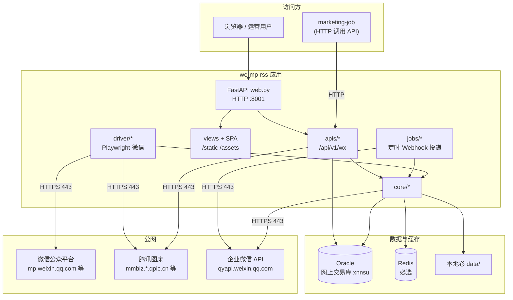
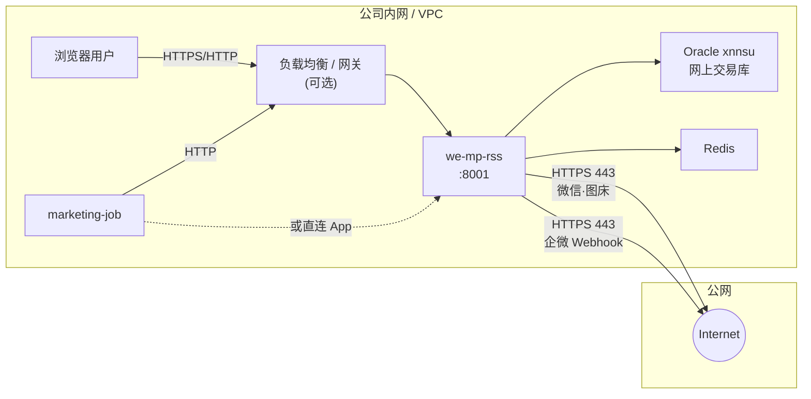

# we-mp-rss 生产环境：对外网络、系统架构与网络部署

本文档描述生产上线所需的**对外网络开通**、**系统架构**与**网络部署**关系。适用于当前规划：**Oracle（网上交易库 xnnsu）**、**必选 Redis**、**企业微信 Webhook 通知**、**无代理 / 无 sing-box**；内部系统 **marketing-job** 通过 **HTTP** 调用本项目接口。

---

## 1. 项目结构（逻辑分层）

| 层级 | 路径 | 职责 |
|------|------|------|
| 入口 | `main.py` | 启动 uvicorn、定时任务、文章补采、授权相关后台 |
| Web / API | `web.py`、`apis/` | FastAPI、`/api/v1/wx/*` 业务 API、静态资源与 SPA |
| 页面（遗留） | `views/`、`public/templates/` | 部分服务端渲染页面 |
| 领域与数据 | `core/` | 配置、数据库、模型、微信采集、通知、缓存等 |
| 微信与浏览器 | `driver/` | Playwright、微信公众平台交互、文章抓取 |
| 定时与任务 | `jobs/` | 同步公众号、Webhook、队列等 |
| 前端 | `web_ui/src/`（构建产物在 `static/`） | 管理端界面 |

**API 前缀**：`/api/v1/wx`（见 `core/base.py`）。  
**默认 HTTP 端口**：`8001`（以 `config.yaml` / 环境变量为准）。

---

## 2. 对外网络调用（出站）

公网域名多为 CDN / 负载均衡，**IP 会变化**，防火墙建议按**域名策略**或经统一出口代理策略放行 **HTTPS 443**；若必须落 IP，需结合 DNS 解析或厂商 IP 段文档动态维护。

### 2.1 微信公众号 / 腾讯侧（业务必选）

| 域名 | 端口 | 说明 |
|------|------|------|
| `mp.weixin.qq.com` | 443 | 公众平台登录、接口与页面（`driver/`、`core/wx/` 等） |
| `mmbiz.qpic.cn` | 443 | 公众号图片 CDN（含 `apis/res.py` 反向代理允许列表） |
| `mmbiz.qlogo.cn` | 443 | 公众号 Logo |
| `mmecoa.qpic.cn` | 443 | 相关素材 CDN |

Playwright 打开公众号页面时，还可能加载页内引用的其他腾讯资源域名，与浏览器访问行为一致；若策略过严，需按实际抓包补充放行。

### 2.2 企业微信通知（Webhook）

| 域名 | 端口 | 说明 |
|------|------|------|
| `qyapi.weixin.qq.com` | 443 | 企业微信机器人 Webhook（`POST` 推送通知） |

通知仅规划 **企微 Webhook**，不在此文档中纳入钉钉、飞书、Bark 等。

### 2.3 DNS

所有上述域名解析依赖 **DNS**（常见为内网 DNS 转发公网解析，或运营商 DNS），需保证运行环境可解析并访问目标 **443**。

---

## 3. 对内与基础设施（东西向 / 内网）

| 目标 | 端口 | 说明 |
|------|------|------|
| **Oracle 网上交易库（xnnsu）** | **1521**（默认，以 DBA 实际为准） | 应用通过 `db` 连接串访问；服务名 / TNS / JDBC URL 中的 **xnnsu** 以运维提供为准 |
| **Redis** | **6379**（未启用 TLS 时）或 **6380**（`rediss` 常见） | **生产必选**，用于 Token 等缓存（`config.example.yaml` 中 `redis` 段） |

数据库、Redis 应仅对 **we-mp-rss 应用网段** 开放，不对公网暴露。

---

## 4. 入站（需开通给调用方）

| 来源 | 目标 | 端口 | 协议 | 说明 |
|------|------|------|------|------|
| 办公网 / 用户 | 负载均衡或应用 | 443 或 8001 | HTTPS / HTTP | 浏览器访问管理端与 API |
| **marketing-job** | 负载均衡或应用 | 443 或 8001 | **HTTP**（或经网关的 HTTP/HTTPS） | 调用本项目 **`/api/v1/wx/...`** 等接口；源 IP / 安全组建议收敛为 job 所在网段 |

鉴权方式需与现网一致（如 OAuth2 Token、`AK-SK` 头等），由接口集成说明单独约定。

---

## 5. 系统架构图（逻辑）

---

## 6. 网络部署图

**说明**：

- 未包含 **sing-box**、**HTTP/SOCKS 代理**；应用直连公网微信与企微域名。
- **marketing-job** 与 **we-mp-rss** 之间为 **HTTP 接口调用**（若经网关，可为 HTTPS 终结后再到应用 HTTP，以实际架构为准）。
- Oracle **xnnsu** 的具体主机名、SCAN、服务名、连接串由 DBA 提供并写入 `config.yaml` / 密钥管理，本文档不写入真实地址。

---

## 7. 开通清单速查

**出站（we-mp-rss → 公网）**

- `mp.weixin.qq.com:443`
- `mmbiz.qpic.cn:443`、`mmbiz.qlogo.cn:443`、`mmecoa.qpic.cn:443`
- `qyapi.weixin.qq.com:443`

**入站**

- 用户与 **marketing-job** → 应用（或 LB）**443 / 8001**（按实际发布方式）

**内网**

- we-mp-rss → **Oracle（xnnsu）**（默认 **1521**，以实际为准）
- we-mp-rss → **Redis**（**6379** 或贵司 Redis 端口）

---

## 8. marketing-job 集成摘要

| 项 | 内容 |
|----|------|
| 调用方式 | **HTTP** 调用本项目 REST 接口 |
| Base URL | 由运维提供（如 `http://werss-app:8001` 或经网关的统一前缀） |
| API 前缀 | `/api/v1/wx` |
| 文档 | 若生产开放：`/api/docs`、`/api/openapi.json` |

---

*文档版本随部署环境调整；连接串、端口、域名以运维与 DBA 最终交付为准。*
